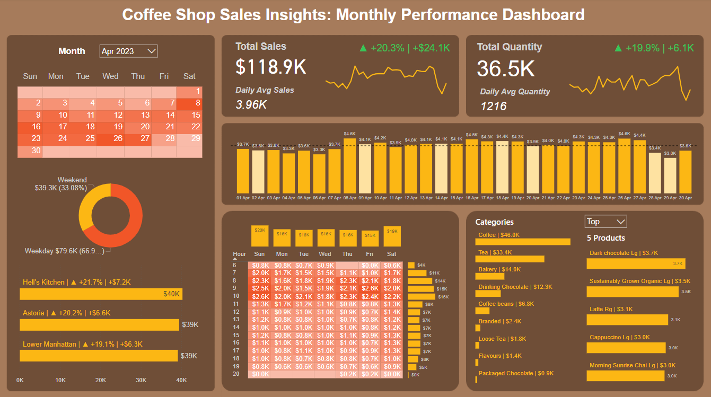
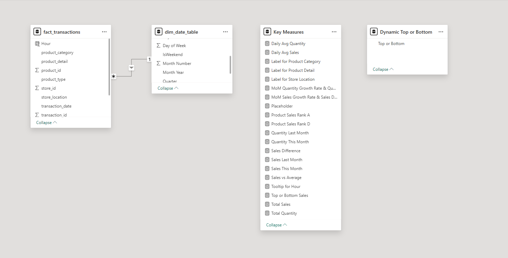

# Coffee Shop Sales Insights: Monthly Performance Dashboard

## Project Overview
This project aims to create a comprehensive dashboard to visualize and analyze in-depth the business performance of a coffee shop. Using Power BI, I have developed a powerful tool to monitor and evaluate the effectiveness of all sales-related activities, thereby supporting quick and accurate business decision-making.

## Data Structure
The sample data is a table stored in MySQL Server with the columns shown below. There are a total of 149,116 rows.

## Tech Stack
- SQL: Data cleaning and ETL
- PowerBI: Creating calculations and visualization

## Data Model

## Data Visualization and Key Insights

### Sales Overview

