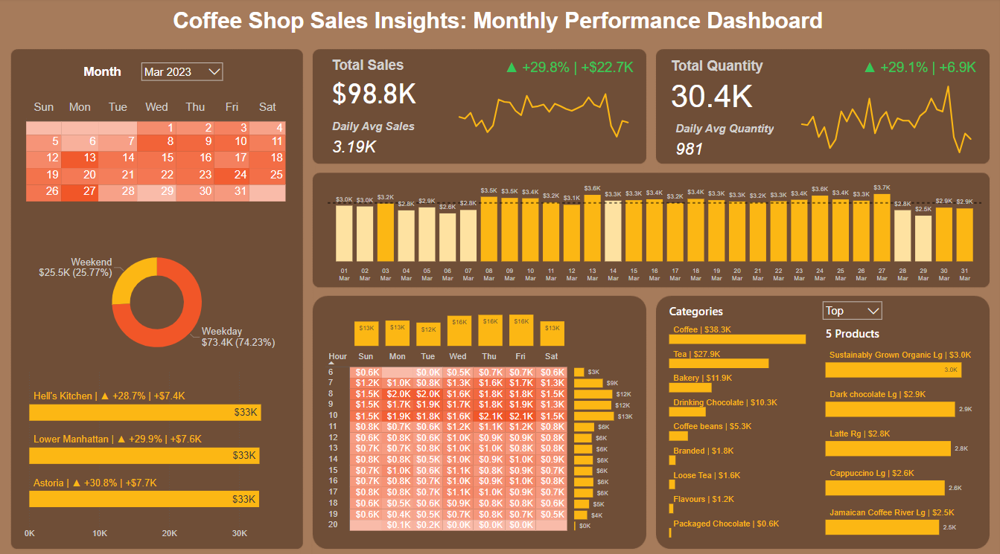

# Coffee Shop Sales Insights: Monthly Performance Dashboard

## Project Overview
This project aims to create a comprehensive dashboard to visualize and analyze in-depth the business performance of a coffee shop. Using Power BI, I have developed a powerful tool to monitor and evaluate the effectiveness of all sales-related activities, thereby supporting quick and accurate business decision-making.

## Data Structure
The sample data is a table stored in MySQL Server with the columns shown below. There are a total of 149,116 rows.

## Tech Stack
- SQL: Data cleaning and ETL
- PowerBI: Creating calculations and visualization

## Data Model

## Data Visualization and Key Insights

March                           | April
:------------------------------:|:--------------------------:
 | 

### Sales Overview
In April 2023, we observed a significant increase in both sales (up 20.3% to $24.1K) and quantity (up 19.9% to 6.1K).
Compared to March, two notable trends emerged:
- Weekend Sales: Sales on weekends increased by 7.31 percentage points, from 25.77% in March to 33.08% in April.
- Dark Chocolate Lg: This product experienced a substantial sales boost, rising from $2.9K in March to $3.7K in April, propelling it from the second to the top-selling product.

### Daily Sales Trend
- Daily sales tended to be lower at the beginning and end of the month, with notable peaks of $3.6K on the 2nd and $3K on the 29th, compared to the monthly average of $3.96K
- The highest daily sales were recorded on the 8th and 26th, reaching $4.6K each. Notably, Jamaica Coffee River Lg and Latte consistently ranked among the top-selling products during these peak sales periods.

### Top Products
- Top categories consistence are coffee, tea, bakery and drinking chocolate.
- Dark Chocolate Lg and Substainably Grown Organic Lg are both part of the "Drinking Chocolate" category, which ranks fourth overall. However they have managed to secure the top spots in the overall product sales ranking. That means these two specific products are outstanding and leading the Chocolate drinking category.

### Sales by Stores and Hours
- All three stores experienced a consistent increase in sales, with Hell's Kitchen slightly outperforming the others, showing a growth of 21.7% ($7.2K).
- Regarding hourly sales patterns, we observed peak performance between 8 AM and 10 AM. During this time, Astonia recorded the lowest sales at $12K, compared to Hell's Kitchen at $17K and Lower Manhattan at $15K.

